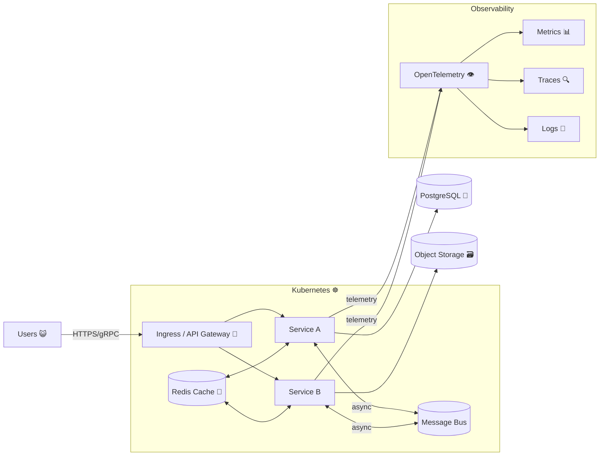

<h1 align="center">✨😺 Ducheved — Senior Architect 🧠☁️</h1>

   
  <em>Always forward, no retreat. But with a little meow.</em>

---

  
  
  
  
  

---

### 🐾 TL;DR
I design and build **distributed systems** ready for real production.  
Main languages: **Golang 🐹** and **Rust 🦀**.  
15+ years in software engineering and **DevOps / Kubernetes (☸️)**.  
Focus: **high availability**, **security**, and **elegant simplicity**.

---

## 🧩 What I Do
- 🧠 **Architecture & Design** — from concept to deployment.  
- ⚙️ **Reliability & HA** — graceful degradation, idempotent flows.  
- 🛠️ **Platform Engineering** — CI/CD, GitOps, scalable developer experience.  
- 🔐 **Security by Default** — zero trust, defense in depth, verified builds.  
- 📈 **Observability** — logs, metrics, and traces that speak truth.

---

## 🌍 Now
- **Senior Architect at Data Secrets Lab** — I designed and implemented the backend and built a platform for ML engineers.  
- **Creator of [Commucat](https://github.com/Ducheved/commucat)** — an ultra-secure **p2p messenger** with strong privacy and zero metadata leakage.  
  > “Even cats deserve encrypted meows.”

---

## 🦄 Languages and Tools
| Tier | Stack |
|------|--------|
| 💎 Primary | Golang, Rust |
| 🌈 Also Used | TypeScript (Next.js, React), Kotlin, Swift, and a bit of C# |

No endless tech stacks — only what really matters.

---

## ☁️ My Architecture Aesthetic
- **Distributed-first mindset** — events, queues, and safe retries.  
- **Operational discipline** — GitOps, immutable infra, canaries, autoscaling.  
- **Data clarity** — strong contracts, deterministic migrations.  
- **Resilience** — recover, retry, never break silently.  
- **Security** — everything encrypted, nothing trusted by default.

---

## 🧭 HA Pattern Example

Focus: graceful failure, fast recovery, and zero drama.

---

## 🧪 Selected Works
- 🐈 **[Commucat (OSS)](https://github.com/Ducheved/commucat)** — private, encrypted, federated messenger.  
- ⚙️ **Rust utilities** — cryptographic experiments and network tooling.  
- 💬 **Side projects** — from pastebins to protocol explorers.

---

## 💡 Principles I Follow
- High availability is **not optional**.  
- Simplicity is **hard, but sacred**.  
- Observability is **part of design**.  
- Security is **a habit, not a feature**.  
- If it’s **hard to do**, it’s probably **worth doing**.

---

## 💬 Contact
- Telegram: **[@ducheved](https://t.me/ducheved)**  
- GitHub: [github.com/Ducheved](https://github.com/Ducheved)  
- Motto: _"If the code purrs — ship it."_ 😸

---

   
  <em>No clichés. No boredom. Only sharp claws, clean code, and cosmic calm.</em>

